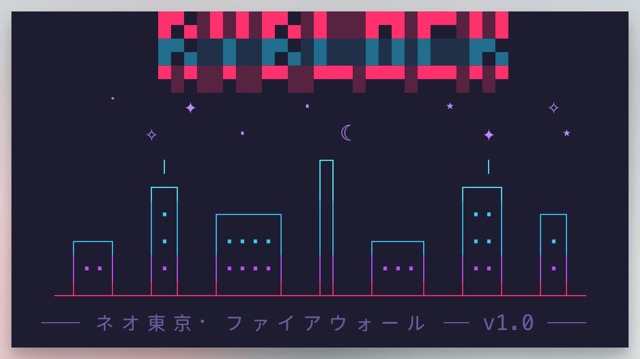
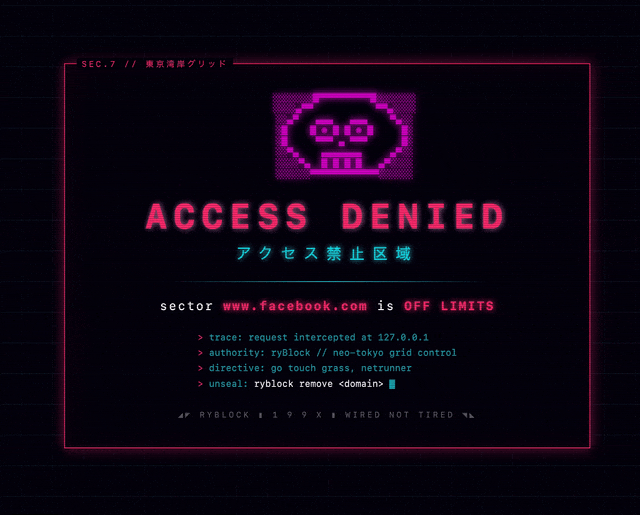

# ryBlock ◢◤ ネオ東京・ファイアウォール

```
█▀▄░█░█░█▀▄░█░░░█▀█░█▀▀░█░█
█▀▄░░█░░█▀▄░█░░░█░█░█░░░█▀▄
▀░▀░░▀░░▀▀░░▀▀▀░▀▀▀░▀▀▀░▀░▀
```



A tiny terminal site blocker with a 90s Japanese cyberpunk theme.

It seals domains in your `/etc/hosts`, flushes the DNS cache for you, and can serve a neon **OFF LIMITS** page so
blocked sites glitch out instead of just timing out. Everything lives behind friendly `rb:*` commands.

## Why

I wanted a blocker I could drive from the terminal in one keystroke, without a menu bar app or a subscription. Editing
`/etc/hosts` by hand works but it is fiddly: you forget the `www.` variant, you forget to flush DNS, and a plain blocked
site just hangs. ryBlock does the boring parts, and the blocked page is a lot more fun to hit than a spinner.

## Install

```fish
cd ryBlock
./install.fish
```

This symlinks the engine onto your `PATH` and installs the `rb:*` commands plus completions. Open a new shell afterwards
so the commands load.

## Usage

```fish
rb:add example.com          # seals example.com and www.example.com
rb:add https://www.x.com/   # URLs are fine, they get normalized to x.com
rb:remove example.com       # unseals both variants (tab-completes sealed domains)
rb:list                     # your sealed sectors, as a neon table
rb:flush                    # purge the DNS cache by hand
rb:serve                    # start the OFF LIMITS page server on :80 and :443
rb:serve status
rb:serve stop
rb:doctor                   # diagnose why a site still loads
```

Short aliases: `rb:block`, `rb:rm`, `rb:ls`.

The `rb:*` commands are thin wrappers over the engine, which you can also call directly as `ryblock <cmd>` (for example
`ryblock add example.com`). Handy in scripts, or from a shell other than Fish.

## Using a shell other than Fish

ryBlock targets [Fish](https://fishshell.com) and ships Fish functions plus completions. The core engine (`ryblock`) is
a Fish script too, so you do need Fish installed to run it today.

If you are on **zsh** or **bash**, the design ports over cleanly. The `rb:*`
commands are just wrappers, so you can add equivalents to your `.zshrc`:

```zsh
rb:add()    { ryblock add "$@"; }
rb:remove() { ryblock remove "$@"; }
rb:list()   { ryblock list "$@"; }
rb:flush()  { ryblock flush; }
rb:serve()  { ryblock serve "$@"; }
```

That still shells out to the Fish engine. A fully native zsh port (rewriting
`ryblock` itself) is very doable given the logic is mostly `awk` and standard tools, and it is a welcome contribution.
For now, Fish is the supported path.

## How it works

Entries live inside a managed block in `/etc/hosts`:

```
# >>> ryBlock >>> (managed block, do not edit by hand)
127.0.0.1	example.com	www.example.com
::1	example.com	www.example.com
# <<< ryBlock <<<
```

The rest of your hosts file is left alone, and the block is removed automatically once the last domain is unsealed.

A few details worth knowing:

- **Normalization.** The scheme, path, port, and a leading `www.` are all stripped, so `https://www.example.com/feed`
  becomes `example.com`. Each site is sealed as both the apex and the `www.` variant, on IPv4 and IPv6.
- **DNS flush.** This runs automatically after every add and remove, and it is best effort. On macOS it calls
  `dscacheutil -flushcache` and
  `killall -HUP mDNSResponder`. On Linux it uses `resolvectl flush-caches`. A failed flush never breaks the command.
- **The wall.** `rb:serve` daemonizes a small Python server (`blockd.py`) that answers every request on `:80` and `:443`
  with a `403` and the neon page.

## Adjust the blocked website

HTML is placed locally inside of `blocked.html` so you can simply adjust it however you'd like. It's completely up to
you.

#### Default blocked webpage UI:



## HTTPS and the neon page

Public certificate authorities (Let's Encrypt included) only sign a cert for a domain you can prove you control. You do
not own `example.com`, so no public cert is possible, and that is why a blocked HTTPS site normally shows a connection
error rather than a page.

The fix is a **local root CA**. `rb:serve` runs `mkcert -install` to trust a CA that only exists on your machine, then
the server mints a per-domain cert on first contact (via an SNI callback) signed by that CA. Your browser trusts the CA,
so `https://example.com` gets a valid cert pointing at loopback and shows the neon page.

```fish
brew install mkcert   # one time, rb:serve runs `mkcert -install` for you
rb:serve
```

Certs are written to `./certs/` and cover the apex, `www.`, and a `*.` wildcard per domain. You do not need to restart
after sealing new sites, since the cert is minted the first time that HTTPS host is hit.

> **Security note.** A trusted local root CA means anything signed by it is
> trusted by your machine. The key stays local and is readable only by root.
> You can undo it any time with `mkcert -uninstall`. Without mkcert, `rb:serve`
> falls back to HTTP only, and HTTPS sites keep erroring (still blocked, just
> without the page).

**Firefox** keeps its own trust store. Run `brew install nss`, then run
`rb:serve` again so `mkcert -install` can register the CA there too. Chrome, Arc, and Safari use the system keychain and
need no extra step.

## Troubleshooting

Start with `rb:doctor`. It checks the wall process, both loopback stacks (IPv4 and IPv6, on `:80` and `:443`), the local
CA, and prints the usual suspects.

- **Connection refused instead of the page.** The wall is not listening where the browser is connecting. Blocked domains
  resolve to both `127.0.0.1` and
  `::1`, and Chromium based browsers often try IPv6 first, so the server listens on both. If `rb:doctor` shows a stack
  refused, the daemon probably died, and
  `rb:serve` will clear a stale pidfile and start cleanly.
- **A site still loads (often YouTube).** This is almost always **Secure DNS**, also known as DoH. The browser resolves
  names over HTTPS and bypasses
  `/etc/hosts` completely. Turn it off in Arc or Chrome under Settings ▸ Privacy ▸ *Use secure DNS*. A hosts based
  blocker cannot override this, and neither can anything else on the machine.
- **Still cached after sealing.** HSTS, service workers (YouTube is a PWA), and HTTP/3 can all survive a flush. Hard
  reload, clear the site data, or restart the browser. `rb:flush` only clears the OS resolver cache.

## Limits, honestly

- **Subdomains.** Hosts files cannot wildcard, so DNS level blocking covers the apex and `www.` only. Add
  `m.example.com` and friends explicitly. The TLS cert carries a `*.` wildcard, but a subdomain still has to resolve to
  loopback first to reach the wall.
- **DoH wins.** A hosts based blocker cannot stop a browser that resolves over its own encrypted DNS. See the
  troubleshooting note above.
- **sudo.** It is requested only when actually writing `/etc/hosts`, flushing the cache, or binding ports 80 and 443.

## Development

You can exercise everything against a throwaway hosts file, so you never touch the real one:

```fish
set -x RYBLOCK_HOSTS /tmp/hosts.test
cp /etc/hosts /tmp/hosts.test
ryblock add example.com   # edits the fake file and skips the real DNS flush
```

## License

MIT
